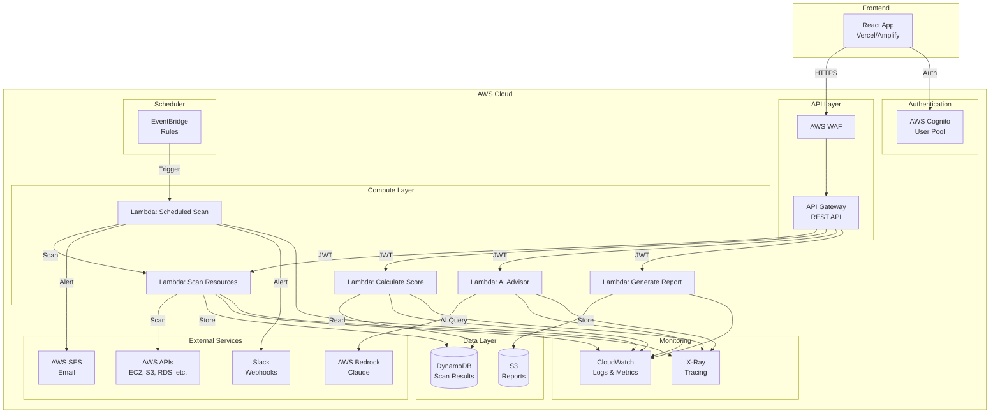

# Design Document

## Overview

ConsoleSensei Cloud will transform from a Flask-based demo into a production-ready AWS serverless SaaS platform. The architecture leverages AWS Lambda for compute, API Gateway for REST APIs, DynamoDB for data persistence, S3 for report storage, EventBridge for scheduling, Cognito for authentication, and integrates AI capabilities through AWS Bedrock or OpenAI.

### Key Design Principles

1. **Serverless-First**: All backend logic runs on AWS Lambda with automatic scaling
2. **Security by Design**: Implement least privilege IAM, encryption at rest/transit, and secure credential handling
3. **Cost-Optimized**: Use pay-per-use services and implement caching strategies
4. **AI-Enhanced**: Integrate AI for cost optimization, security analysis, and natural language interactions
5. **Observable**: Comprehensive logging, metrics, and tracing for production operations
6. **Maintainable**: Clear separation of concerns, modular architecture, and Infrastructure as Code

### Technology Stack

**Backend:**
- AWS Lambda (Python 3.11 or Node.js 18)
- AWS API Gateway (REST API)
- AWS DynamoDB (NoSQL database)
- AWS S3 (Report storage)
- AWS EventBridge (Scheduler)
- AWS Cognito (Authentication)
- AWS Bedrock (AI - Claude) or OpenAI API
- AWS SES (Email notifications)
- AWS CloudWatch (Logging and metrics)
- AWS X-Ray (Distributed tracing)

**Frontend:**
- React 18 with TypeScript
- Vite (Build tool)
- TanStack Query (Data fetching)
- Tailwind CSS (Styling)
- Deployed on Vercel or AWS Amplify

**Infrastructure:**
- AWS SAM or AWS CDK for Infrastructure as Code
- GitHub Actions for CI/CD


## Architecture

### High-Level Architecture



### Architecture Layers

#### 1. Frontend Layer
- React SPA with TypeScript
- Authenticates users via Cognito
- Calls API Gateway endpoints with JWT tokens
- Implements caching and optimistic updates
- Handles loading states and error boundaries

#### 2. API Gateway Layer
- REST API with resource-based routing
- JWT authorizer validates Cognito tokens
- Request validation and transformation
- Rate limiting per user
- CORS configuration
- AWS WAF for DDoS and injection protection

#### 3. Lambda Compute Layer
- **Scan Lambda**: Orchestrates multi-region AWS resource scanning
- **Score Lambda**: Calculates hygiene score from scan results
- **AI Lambda**: Handles AI requests (cost advisor, risk summary, IAM explainer, chat)
- **Report Lambda**: Generates PDF reports and architecture diagrams
- **Scheduler Lambda**: Triggered by EventBridge for automated scans
- **Alert Lambda**: Processes scan results and sends notifications

#### 4. Data Layer
- **DynamoDB Tables**:
  - `ScanResults`: Stores scan data with GSI on userId and timestamp
  - `Users`: Stores user preferences and alert configurations
  - `AlertHistory`: Stores sent alerts with deduplication keys
- **S3 Buckets**:
  - `reports-bucket`: Stores generated PDF reports
  - `diagrams-bucket`: Stores architecture diagrams

#### 5. Integration Layer
- AWS SDK for resource scanning (boto3 or AWS SDK for JavaScript)
- AWS Bedrock SDK for AI capabilities
- AWS SES for email notifications
- Slack SDK for webhook notifications
- AWS Cost Explorer API for cost data

#### 6. Scheduler Layer
- EventBridge rules for scheduled scans
- Configurable cron expressions per user
- Triggers Scheduler Lambda with user context

#### 7. Monitoring Layer
- CloudWatch Logs for all Lambda functions
- CloudWatch Metrics for custom metrics
- CloudWatch Alarms for error rates and latency
- X-Ray for distributed tracing
- CloudWatch Dashboard for operational visibility


## Components and Interfaces

### Backend Components

#### 1. Scan Lambda Function

**Purpose**: Orchestrate AWS resource scanning across all regions

**Handler**: `scan_handler(event, context)`

**Input**:
```json
{
  "userId": "string",
  "roleArn": "string (optional for cross-account)",
  "regions": ["string"] (optional, defaults to all)
}
```

**Output**:
```json
{
  "scanId": "string",
  "timestamp": "ISO8601",
  "resources": [...],
  "summary": {...},
  "errors": [...]
}
```

**Key Functions**:
- `assume_role(role_arn)`: Assumes cross-account IAM role
- `get_enabled_regions()`: Discovers enabled AWS regions
- `scan_region(region, services)`: Scans all services in a region
- `scan_ec2(region)`: Scans EC2 instances, volumes, IPs, security groups
- `scan_s3()`: Scans S3 buckets (global)
- `scan_rds(region)`: Scans RDS instances
- `scan_lambda(region)`: Scans Lambda functions
- `scan_iam()`: Scans IAM users, roles, policies
- `scan_cost_explorer()`: Fetches cost data
- `store_scan_result(scan_data)`: Stores in DynamoDB

**Concurrency**: Uses ThreadPoolExecutor for parallel region scanning

**Timeout**: 5 minutes

**Memory**: 1024 MB

#### 2. Score Lambda Function

**Purpose**: Calculate hygiene score from scan results

**Handler**: `score_handler(event, context)`

**Input**:
```json
{
  "scanId": "string"
}
```

**Output**:
```json
{
  "score": 85,
  "breakdown": {
    "security": 34,
    "costEfficiency": 26,
    "bestPractices": 25
  },
  "issues": [...]
}
```

**Key Functions**:
- `calculate_security_score(resources)`: Calculates security component (40%)
  - Checks for public S3 buckets
  - Checks for 0.0.0.0/0 security groups
  - Checks for unencrypted volumes
  - Checks for IAM users without MFA
  - Checks for overly permissive IAM policies
- `calculate_cost_score(resources)`: Calculates cost efficiency component (30%)
  - Identifies stopped instances
  - Identifies unattached volumes
  - Identifies unassociated Elastic IPs
  - Identifies oversized instances
- `calculate_best_practices_score(resources)`: Calculates best practices component (30%)
  - Checks tagging compliance
  - Checks backup policies
  - Checks monitoring configuration
- `aggregate_score(components)`: Combines weighted scores

**Timeout**: 1 minute

**Memory**: 512 MB

#### 3. AI Lambda Function

**Purpose**: Handle all AI-powered features

**Handler**: `ai_handler(event, context)`

**Input**:
```json
{
  "action": "cost_advisor | risk_summary | iam_explainer | chat",
  "data": {...}
}
```

**Output**: Varies by action

**Key Functions**:
- `generate_cost_recommendations(scan_data, cost_data)`: Generates cost optimization advice
- `generate_risk_summary(security_issues)`: Summarizes security risks
- `explain_iam_policy(policy_json)`: Explains IAM policy in plain English
- `chat_query(question, context)`: Answers natural language questions
- `call_bedrock(prompt, model)`: Calls AWS Bedrock API
- `call_openai(prompt, model)`: Calls OpenAI API (fallback)
- `format_prompt(action, data)`: Formats prompts for AI models

**AI Model Selection**:
- Primary: AWS Bedrock with Claude 3 Sonnet
- Fallback: OpenAI GPT-4

**Timeout**: 30 seconds

**Memory**: 512 MB

#### 4. Report Lambda Function

**Purpose**: Generate PDF reports and architecture diagrams

**Handler**: `report_handler(event, context)`

**Input**:
```json
{
  "scanId": "string",
  "reportType": "pdf | diagram",
  "options": {...}
}
```

**Output**:
```json
{
  "reportUrl": "string (signed S3 URL)",
  "expiresAt": "ISO8601"
}
```

**Key Functions**:
- `generate_pdf_report(scan_data, score_data)`: Creates PDF using ReportLab or Puppeteer
- `generate_architecture_diagram(resources)`: Creates diagram using Graphviz or D3
- `upload_to_s3(file, bucket)`: Uploads to S3
- `generate_signed_url(s3_key, expiration)`: Creates time-limited download URL

**Timeout**: 2 minutes

**Memory**: 1024 MB

#### 5. Scheduler Lambda Function

**Purpose**: Execute scheduled scans and send alerts

**Handler**: `scheduler_handler(event, context)`

**Input** (from EventBridge):
```json
{
  "userId": "string",
  "scheduleConfig": {...}
}
```

**Key Functions**:
- `trigger_scan(user_id)`: Invokes Scan Lambda
- `compare_with_previous(current_scan, previous_scan)`: Detects changes
- `check_alert_thresholds(scan_data, user_config)`: Evaluates alert conditions
- `send_email_alert(user_email, alert_data)`: Sends via SES
- `send_slack_alert(webhook_url, alert_data)`: Sends via Slack webhook
- `deduplicate_alert(alert_key)`: Prevents duplicate notifications

**Timeout**: 5 minutes

**Memory**: 512 MB

#### 6. Auth Lambda Function

**Purpose**: Handle custom authentication logic

**Handler**: `auth_handler(event, context)`

**Key Functions**:
- `validate_jwt(token)`: Validates Cognito JWT
- `get_user_permissions(user_id)`: Retrieves user permissions
- `authorize_request(user, resource)`: Checks authorization

**Timeout**: 10 seconds

**Memory**: 256 MB

### Frontend Components

#### 1. API Service Layer

**File**: `src/services/aws-service.ts`

**Key Functions**:
```typescript
class AWSService {
  async scanResources(): Promise<ScanResult>
  async getLatestScan(): Promise<ScanResult>
  async getHygieneScore(scanId: string): Promise<ScoreResult>
  async getCostRecommendations(scanId: string): Promise<AIRecommendation[]>
  async getRiskSummary(scanId: string): Promise<RiskSummary>
  async explainIAMPolicy(policyJson: string): Promise<PolicyExplanation>
  async chatQuery(question: string, context: string): Promise<ChatResponse>
  async generateReport(scanId: string, type: 'pdf' | 'diagram'): Promise<string>
  async getScheduleConfig(): Promise<ScheduleConfig>
  async updateScheduleConfig(config: ScheduleConfig): Promise<void>
}
```

#### 2. Authentication Service

**File**: `src/services/auth-service.ts`

**Key Functions**:
```typescript
class AuthService {
  async signUp(email: string, password: string): Promise<void>
  async signIn(email: string, password: string): Promise<AuthResult>
  async signOut(): Promise<void>
  async resetPassword(email: string): Promise<void>
  async confirmPassword(code: string, newPassword: string): Promise<void>
  async getCurrentUser(): Promise<User>
  async getIdToken(): Promise<string>
}
```

#### 3. React Hooks

**File**: `src/hooks/use-aws-data.ts`

```typescript
function useLatestScan(): {
  data: ScanResult | undefined
  isLoading: boolean
  error: Error | null
  refetch: () => void
}

function useHygieneScore(scanId: string): {
  data: ScoreResult | undefined
  isLoading: boolean
  error: Error | null
}

function useCostRecommendations(scanId: string): {
  data: AIRecommendation[] | undefined
  isLoading: boolean
  error: Error | null
}
```

### API Endpoints

#### REST API Structure

**Base URL**: `https://api.consolesensei.com/v1`

**Authentication**: Bearer token (Cognito JWT) in Authorization header

**Endpoints**:

1. **POST /scan**
   - Initiates a new scan
   - Request: `{ "roleArn": "string (optional)" }`
   - Response: `{ "scanId": "string", "status": "in_progress" }`

2. **GET /scan/{scanId}**
   - Retrieves scan results
   - Response: `ScanResult`

3. **GET /scan/latest**
   - Retrieves latest scan for authenticated user
   - Response: `ScanResult`

4. **GET /score/{scanId}**
   - Retrieves hygiene score
   - Response: `ScoreResult`

5. **POST /ai/cost-advisor**
   - Generates cost recommendations
   - Request: `{ "scanId": "string" }`
   - Response: `{ "recommendations": [...] }`

6. **POST /ai/risk-summary**
   - Generates security risk summary
   - Request: `{ "scanId": "string" }`
   - Response: `{ "summary": "string", "issues": [...] }`

7. **POST /ai/iam-explainer**
   - Explains IAM policy
   - Request: `{ "policyJson": "string" }`
   - Response: `{ "explanation": "string", "risks": [...] }`

8. **POST /ai/chat**
   - Chat with Cloud Copilot
   - Request: `{ "question": "string", "context": {...} }`
   - Response: `{ "answer": "string", "sources": [...] }`

9. **POST /report/generate**
   - Generates PDF report
   - Request: `{ "scanId": "string", "type": "pdf" }`
   - Response: `{ "reportUrl": "string", "expiresAt": "string" }`

10. **GET /schedule**
    - Gets user's schedule configuration
    - Response: `ScheduleConfig`

11. **PUT /schedule**
    - Updates schedule configuration
    - Request: `ScheduleConfig`
    - Response: `{ "success": true }`

12. **GET /alerts**
    - Gets alert history
    - Response: `{ "alerts": [...] }`


## Data Models

### DynamoDB Tables

#### 1. ScanResults Table

**Primary Key**: 
- Partition Key: `scanId` (String)

**Global Secondary Indexes**:
- GSI1: `userId` (Partition Key) + `timestamp` (Sort Key)

**Attributes**:
```json
{
  "scanId": "scan_20240115_abc123",
  "userId": "user_xyz",
  "timestamp": "2024-01-15T10:30:00Z",
  "resources": [
    {
      "resourceId": "i-1234567890abcdef0",
      "resourceType": "EC2_Instance",
      "region": "us-east-1",
      "state": "running",
      "tags": {...},
      "metadata": {...}
    }
  ],
  "summary": {
    "totalResources": 150,
    "byType": {...},
    "byRegion": {...}
  },
  "costData": {
    "estimatedMonthly": 1250.50,
    "byService": {...}
  },
  "ttl": 1234567890
}
```

**TTL**: 90 days

#### 2. Users Table

**Primary Key**:
- Partition Key: `userId` (String)

**Attributes**:
```json
{
  "userId": "user_xyz",
  "email": "user@example.com",
  "cognitoSub": "cognito-sub-id",
  "roleArn": "arn:aws:iam::123456789012:role/ConsoleSenseiRole",
  "scheduleConfig": {
    "enabled": true,
    "frequency": "daily",
    "cronExpression": "0 9 * * *",
    "timezone": "America/New_York"
  },
  "alertConfig": {
    "email": {
      "enabled": true,
      "address": "user@example.com"
    },
    "slack": {
      "enabled": true,
      "webhookUrl": "https://hooks.slack.com/..."
    },
    "thresholds": {
      "hygieneScoreDrop": 10,
      "costIncreasePercent": 20
    }
  },
  "preferences": {
    "defaultRegions": ["us-east-1", "us-west-2"],
    "aiModel": "bedrock-claude"
  },
  "createdAt": "2024-01-01T00:00:00Z",
  "updatedAt": "2024-01-15T10:30:00Z"
}
```

#### 3. HygieneScores Table

**Primary Key**:
- Partition Key: `scanId` (String)

**Attributes**:
```json
{
  "scanId": "scan_20240115_abc123",
  "userId": "user_xyz",
  "timestamp": "2024-01-15T10:30:00Z",
  "overallScore": 85,
  "breakdown": {
    "security": {
      "score": 34,
      "maxScore": 40,
      "issues": [
        {
          "type": "public_s3_bucket",
          "severity": "high",
          "resourceId": "my-bucket",
          "deduction": 5
        }
      ]
    },
    "costEfficiency": {
      "score": 26,
      "maxScore": 30,
      "issues": [...]
    },
    "bestPractices": {
      "score": 25,
      "maxScore": 30,
      "issues": [...]
    }
  },
  "ttl": 1234567890
}
```

#### 4. AlertHistory Table

**Primary Key**:
- Partition Key: `alertId` (String)

**Global Secondary Indexes**:
- GSI1: `userId` (Partition Key) + `timestamp` (Sort Key)

**Attributes**:
```json
{
  "alertId": "alert_20240115_xyz",
  "userId": "user_xyz",
  "timestamp": "2024-01-15T10:35:00Z",
  "alertType": "hygiene_score_drop",
  "severity": "medium",
  "message": "Hygiene score dropped from 95 to 85",
  "details": {...},
  "channels": ["email", "slack"],
  "deduplicationKey": "hygiene_score_drop_user_xyz_20240115",
  "ttl": 1234567890
}
```

**TTL**: 30 days

#### 5. AICache Table

**Primary Key**:
- Partition Key: `cacheKey` (String)

**Attributes**:
```json
{
  "cacheKey": "cost_advisor_scan_20240115_abc123",
  "userId": "user_xyz",
  "response": {...},
  "createdAt": "2024-01-15T10:30:00Z",
  "ttl": 1234567890
}
```

**TTL**: 24 hours

### S3 Bucket Structure

#### reports-bucket

```
reports-bucket/
├── {userId}/
│   ├── {scanId}/
│   │   ├── report.pdf
│   │   └── metadata.json
```

**Lifecycle Policy**: Delete objects after 30 days

**Encryption**: AES-256 (SSE-S3)

#### diagrams-bucket

```
diagrams-bucket/
├── {userId}/
│   ├── {scanId}/
│   │   ├── architecture.png
│   │   └── architecture.svg
```

**Lifecycle Policy**: Delete objects after 30 days

**Encryption**: AES-256 (SSE-S3)

### TypeScript Interfaces

```typescript
interface ScanResult {
  scanId: string
  userId: string
  timestamp: string
  resources: Resource[]
  summary: ScanSummary
  costData: CostData
  errors: ScanError[]
}

interface Resource {
  resourceId: string
  resourceName: string
  resourceType: ResourceType
  region: string
  state: string
  creationDate: string
  tags: Record<string, string>
  metadata: Record<string, any>
  estimatedCostMonthly?: number
}

type ResourceType = 
  | 'EC2_Instance'
  | 'EBS_Volume'
  | 'S3_Bucket'
  | 'RDS_Instance'
  | 'Lambda_Function'
  | 'Load_Balancer'
  | 'NAT_Gateway'
  | 'Elastic_IP'
  | 'IAM_User'
  | 'IAM_Role'

interface ScoreResult {
  scanId: string
  overallScore: number
  breakdown: {
    security: ScoreComponent
    costEfficiency: ScoreComponent
    bestPractices: ScoreComponent
  }
}

interface ScoreComponent {
  score: number
  maxScore: number
  issues: Issue[]
}

interface Issue {
  type: string
  severity: 'critical' | 'high' | 'medium' | 'low'
  resourceId: string
  description: string
  deduction: number
  fixGuide?: FixGuide
}

interface FixGuide {
  title: string
  steps: string[]
  cliCommands?: string[]
  consoleSteps?: string[]
  documentationUrl?: string
}

interface AIRecommendation {
  id: string
  category: 'cost' | 'security' | 'performance'
  title: string
  description: string
  estimatedSavings?: number
  priority: 'high' | 'medium' | 'low'
  affectedResources: string[]
  actionItems: string[]
}

interface ScheduleConfig {
  enabled: boolean
  frequency: 'daily' | 'weekly' | 'custom'
  cronExpression?: string
  timezone: string
}

interface AlertConfig {
  email: {
    enabled: boolean
    address: string
  }
  slack: {
    enabled: boolean
    webhookUrl: string
  }
  thresholds: {
    hygieneScoreDrop: number
    costIncreasePercent: number
  }
}
```


## Correctness Properties

A property is a characteristic or behavior that should hold true across all valid executions of a system—essentially, a formal statement about what the system should do. Properties serve as the bridge between human-readable specifications and machine-verifiable correctness guarantees.

### Property 1: Region Discovery Completeness

*For any* AWS account with enabled regions, when the Scanner discovers regions, the returned list should be non-empty and contain only valid AWS region identifiers.

**Validates: Requirements 3.1**

### Property 2: Resource Type Coverage

*For any* AWS region containing resources, when the Scanner scans that region, the scan results should include all supported resource types (EC2, S3, RDS, Lambda, ELB, IAM, CloudWatch) that exist in that region.

**Validates: Requirements 3.2, 3.3, 3.4, 3.5, 3.6, 3.7, 3.8**

### Property 3: Scan Result Persistence Round Trip

*For any* scan result, storing it in DynamoDB and then retrieving it should produce an equivalent scan result with the same scanId, userId, timestamp, and resources.

**Validates: Requirements 3.9, 19.1**

### Property 4: Error Isolation in Multi-Region Scanning

*For any* multi-region scan where one region fails, the Scanner should still successfully scan and return results from all other accessible regions.

**Validates: Requirements 3.10**

### Property 5: Hygiene Score Bounds

*For any* scan result, the calculated hygiene score should be a number between 0 and 100 (inclusive).

**Validates: Requirements 4.1**

### Property 6: Security Score Weighting

*For any* hygiene score calculation, the security component should contribute exactly 40% of the maximum possible score (40 points out of 100).

**Validates: Requirements 4.2**

### Property 7: Security Issues Reduce Security Score

*For any* two scan results that are identical except one contains security issues (public S3 buckets, open security groups, unencrypted volumes, IAM users without MFA, or overly permissive policies), the scan with security issues should have a lower security score.

**Validates: Requirements 4.3, 4.4, 4.5, 4.6, 4.7**

### Property 8: Cost Efficiency Score Weighting

*For any* hygiene score calculation, the cost efficiency component should contribute exactly 30% of the maximum possible score (30 points out of 100).

**Validates: Requirements 4.8**

### Property 9: Cost Issues Reduce Cost Efficiency Score

*For any* two scan results that are identical except one contains cost inefficiencies (stopped instances, unattached volumes, underutilized instances, or unassociated Elastic IPs), the scan with cost issues should have a lower cost efficiency score.

**Validates: Requirements 4.9, 4.10, 4.11, 4.12**

### Property 10: Best Practices Score Weighting

*For any* hygiene score calculation, the best practices component should contribute exactly 30% of the maximum possible score (30 points out of 100).

**Validates: Requirements 4.13**

### Property 11: Best Practice Violations Reduce Best Practices Score

*For any* two scan results that are identical except one contains best practice violations (missing tags, missing backups, or disabled monitoring), the scan with violations should have a lower best practices score.

**Validates: Requirements 4.14, 4.15, 4.16**

### Property 12: Score Breakdown Completeness

*For any* hygiene score calculation, the API response should include a breakdown object with security, costEfficiency, and bestPractices components, each containing score, maxScore, and issues fields.

**Validates: Requirements 4.18**

### Property 13: Cost Recommendations Include Savings

*For any* AI-generated cost recommendation, it should include an estimatedSavings field with a non-negative number.

**Validates: Requirements 6.3, 6.7**

### Property 14: Right-Sizing Recommendations for Oversized Instances

*For any* scan result containing oversized instances (instances with consistently low CPU utilization), the AI cost recommendations should include at least one right-sizing suggestion.

**Validates: Requirements 6.4**

### Property 15: Recommendations Sorted by Savings

*For any* list of AI cost recommendations, they should be sorted in descending order by estimatedSavings amount.

**Validates: Requirements 6.8**

### Property 16: AI Recommendation Caching

*For any* scan result, requesting AI cost recommendations twice within 24 hours should return the same cached recommendations without making a second AI API call.

**Validates: Requirements 6.10**

### Property 17: Scan Comparison Identifies Differences

*For any* two different scan results, the comparison function should identify and return all differences in resource counts, hygiene scores, and detected issues.

**Validates: Requirements 10.3**

### Property 18: Alert Generation for New Security Issues

*For any* scheduled scan that detects new security issues not present in the previous scan, the Alert System should generate an alert with type "new_security_issues".

**Validates: Requirements 10.4**

### Property 19: Alert Generation for Score Drop

*For any* scheduled scan where the hygiene score drops below the user's configured threshold, the Alert System should generate an alert with type "hygiene_score_drop".

**Validates: Requirements 10.5**

### Property 20: Alert Generation for Cost Increase

*For any* scheduled scan where the cost increases by more than the user's configured threshold percentage, the Alert System should generate an alert with type "cost_increase".

**Validates: Requirements 10.6**

### Property 21: Alert Configuration Persistence Round Trip

*For any* alert configuration, storing it in DynamoDB and then retrieving it should produce an equivalent configuration with the same thresholds and notification preferences.

**Validates: Requirements 10.10**

### Property 22: Alert Includes Change Summary

*For any* generated alert, it should include a summary field containing a description of what changed between scans.

**Validates: Requirements 10.11**

### Property 23: Alert Deduplication

*For any* alert with the same deduplication key, sending it twice within a 24-hour window should result in only one notification being sent.

**Validates: Requirements 10.12**

### Property 24: PDF Report Completeness

*For any* generated PDF report, it should include all required sections: hygiene score breakdown, resource inventory by type and region, security findings with severity levels, cost breakdown and trends, and AI-generated recommendations.

**Validates: Requirements 12.2, 12.3, 12.4, 12.5, 12.6**

### Property 25: PDF Storage with Signed URL

*For any* generated PDF report, it should be stored in S3 and a signed URL should be returned that allows downloading the PDF.

**Validates: Requirements 12.7**

### Property 26: Historical Scan Query by Date Range

*For any* date range query, the returned scan results should only include scans with timestamps within the specified start and end dates (inclusive).

**Validates: Requirements 19.8**

### Property 27: Trend Data Structure Completeness

*For any* trend calculation between two scans, the trend data should include changes in hygiene score, resource counts by type, and estimated costs.

**Validates: Requirements 19.3, 19.4, 19.5, 19.6**


## Error Handling

### Error Categories

#### 1. AWS API Errors

**Scenarios**:
- Invalid credentials
- Insufficient permissions
- Rate limiting (throttling)
- Service unavailable
- Region not accessible

**Handling Strategy**:
- Implement exponential backoff with jitter for throttling errors
- Log detailed error information to CloudWatch
- Continue scanning other resources/regions when one fails
- Return partial results with error details in the errors array
- Use AWS SDK built-in retry logic

**Example**:
```python
try:
    response = ec2_client.describe_instances()
except ClientError as e:
    error_code = e.response['Error']['Code']
    if error_code == 'UnauthorizedOperation':
        logger.error(f"Insufficient permissions for EC2 in {region}")
        errors.append({
            'type': 'permission_error',
            'service': 'EC2',
            'region': region,
            'message': 'Insufficient permissions'
        })
    elif error_code == 'RequestLimitExceeded':
        # Retry with exponential backoff
        time.sleep(2 ** retry_count)
        retry_count += 1
```

#### 2. AI Service Errors

**Scenarios**:
- AI API rate limits
- AI API timeouts
- Invalid prompts
- Model unavailable

**Handling Strategy**:
- Implement retry logic with exponential backoff (max 3 retries)
- Fall back to cached responses if available
- Return graceful error messages to users
- Log AI errors separately for monitoring
- Implement circuit breaker pattern for repeated failures

**Example**:
```python
@retry(max_attempts=3, backoff=exponential_backoff)
async def call_ai_service(prompt):
    try:
        response = await bedrock_client.invoke_model(prompt)
        return response
    except RateLimitError:
        # Check cache first
        cached = get_from_cache(cache_key)
        if cached:
            return cached
        raise
    except TimeoutError:
        logger.error("AI service timeout")
        return {
            'error': 'AI service temporarily unavailable',
            'fallback': True
        }
```

#### 3. Data Persistence Errors

**Scenarios**:
- DynamoDB throttling
- DynamoDB item size limit exceeded
- S3 upload failures
- Network connectivity issues

**Handling Strategy**:
- Implement automatic retries with exponential backoff
- Use DynamoDB batch operations where possible
- Compress large scan results before storing
- Implement dead letter queues for failed operations
- Monitor DynamoDB capacity and scale automatically

**Example**:
```python
try:
    table.put_item(Item=scan_result)
except ClientError as e:
    if e.response['Error']['Code'] == 'ProvisionedThroughputExceededException':
        # Retry with backoff
        await asyncio.sleep(2 ** retry_count)
        retry_count += 1
    elif e.response['Error']['Code'] == 'ItemSizeTooLarge':
        # Compress and retry
        compressed_result = compress_scan_result(scan_result)
        table.put_item(Item=compressed_result)
```

#### 4. Authentication Errors

**Scenarios**:
- Expired JWT tokens
- Invalid tokens
- Missing authentication
- Insufficient permissions

**Handling Strategy**:
- Return 401 Unauthorized for authentication failures
- Return 403 Forbidden for authorization failures
- Provide clear error messages
- Log authentication failures for security monitoring
- Implement token refresh flow in frontend

**Example**:
```python
def validate_jwt(token):
    try:
        decoded = jwt.decode(token, public_key, algorithms=['RS256'])
        return decoded
    except jwt.ExpiredSignatureError:
        raise AuthenticationError('Token expired', status_code=401)
    except jwt.InvalidTokenError:
        raise AuthenticationError('Invalid token', status_code=401)
```

#### 5. Frontend Errors

**Scenarios**:
- Network failures
- API timeouts
- Invalid responses
- Component rendering errors

**Handling Strategy**:
- Implement error boundaries to catch React errors
- Display user-friendly error messages
- Implement automatic retry for transient failures
- Show loading states during retries
- Log errors to monitoring service

**Example**:
```typescript
class ErrorBoundary extends React.Component {
  componentDidCatch(error, errorInfo) {
    logErrorToService(error, errorInfo)
    this.setState({ hasError: true })
  }

  render() {
    if (this.state.hasError) {
      return <ErrorFallback />
    }
    return this.props.children
  }
}
```

### Error Response Format

All API errors should follow a consistent format:

```json
{
  "success": false,
  "error": {
    "code": "SCAN_FAILED",
    "message": "Failed to scan AWS resources",
    "details": "Insufficient permissions for EC2 in us-east-1",
    "timestamp": "2024-01-15T10:30:00Z",
    "requestId": "abc-123-def-456"
  }
}
```

### Monitoring and Alerting

- CloudWatch Alarms for Lambda error rates > 5%
- CloudWatch Alarms for API Gateway 5xx errors > 1%
- CloudWatch Alarms for DynamoDB throttling events
- X-Ray tracing for error investigation
- SNS notifications for critical errors


## Testing Strategy

### Dual Testing Approach

The system will use both unit tests and property-based tests for comprehensive coverage:

- **Unit tests**: Verify specific examples, edge cases, and error conditions
- **Property tests**: Verify universal properties across all inputs
- Both are complementary and necessary for comprehensive coverage

Unit tests are helpful for specific examples and edge cases, but we should avoid writing too many unit tests since property-based tests handle covering lots of inputs. Unit tests should focus on:
- Specific examples that demonstrate correct behavior
- Integration points between components
- Edge cases and error conditions

Property tests should focus on:
- Universal properties that hold for all inputs
- Comprehensive input coverage through randomization

### Property-Based Testing

**Library Selection**:
- **Python**: Use `hypothesis` library
- **TypeScript/JavaScript**: Use `fast-check` library

**Configuration**:
- Minimum 100 iterations per property test (due to randomization)
- Each property test must reference its design document property
- Tag format: `Feature: production-aws-saas-transformation, Property {number}: {property_text}`

**Example Property Test (Python)**:
```python
from hypothesis import given, strategies as st
import pytest

@given(
    scan_result=st.builds(ScanResult, 
        resources=st.lists(st.builds(Resource)),
        timestamp=st.datetimes(),
        userId=st.text(min_size=1)
    )
)
def test_property_3_scan_result_persistence_round_trip(scan_result):
    """
    Feature: production-aws-saas-transformation
    Property 3: Scan Result Persistence Round Trip
    
    For any scan result, storing it in DynamoDB and then retrieving it 
    should produce an equivalent scan result.
    """
    # Store
    store_scan_result(scan_result)
    
    # Retrieve
    retrieved = get_scan_result(scan_result.scanId)
    
    # Assert equivalence
    assert retrieved.scanId == scan_result.scanId
    assert retrieved.userId == scan_result.userId
    assert retrieved.timestamp == scan_result.timestamp
    assert len(retrieved.resources) == len(scan_result.resources)
```

**Example Property Test (TypeScript)**:
```typescript
import fc from 'fast-check'
import { describe, it, expect } from 'vitest'

describe('Property 5: Hygiene Score Bounds', () => {
  it('should calculate scores between 0 and 100 for any scan result', () => {
    /**
     * Feature: production-aws-saas-transformation
     * Property 5: Hygiene Score Bounds
     * 
     * For any scan result, the calculated hygiene score should be 
     * a number between 0 and 100 (inclusive).
     */
    fc.assert(
      fc.property(
        fc.record({
          scanId: fc.string(),
          resources: fc.array(fc.record({
            resourceType: fc.constantFrom('EC2_Instance', 'S3_Bucket', 'RDS_Instance'),
            state: fc.string(),
            tags: fc.dictionary(fc.string(), fc.string())
          }))
        }),
        (scanResult) => {
          const score = calculateHygieneScore(scanResult)
          expect(score).toBeGreaterThanOrEqual(0)
          expect(score).toBeLessThanOrEqual(100)
        }
      ),
      { numRuns: 100 }
    )
  })
})
```

### Unit Testing

**Test Coverage Goals**:
- Minimum 80% code coverage
- 100% coverage for critical paths (scoring algorithm, authentication)

**Unit Test Categories**:

1. **Scanner Unit Tests**:
   - Test individual service scanners (EC2, S3, RDS, etc.)
   - Test error handling for API failures
   - Test credential handling
   - Mock AWS SDK calls

2. **Score Calculation Unit Tests**:
   - Test security score calculation with specific issues
   - Test cost efficiency score calculation
   - Test best practices score calculation
   - Test score weighting
   - Test edge cases (empty scan, all perfect resources)

3. **AI Service Unit Tests**:
   - Test prompt formatting
   - Test response parsing
   - Test caching logic
   - Test retry logic
   - Mock AI API calls

4. **Alert System Unit Tests**:
   - Test threshold evaluation
   - Test deduplication logic
   - Test notification formatting
   - Mock SES and Slack APIs

5. **Report Generation Unit Tests**:
   - Test PDF generation with sample data
   - Test diagram generation
   - Test S3 upload
   - Test signed URL generation

**Example Unit Test**:
```python
def test_security_score_deduction_for_public_s3_bucket():
    """Test that public S3 buckets reduce security score"""
    # Arrange
    scan_with_public_bucket = create_scan_result(
        resources=[
            create_s3_bucket(public=True, encrypted=False)
        ]
    )
    scan_without_issues = create_scan_result(
        resources=[
            create_s3_bucket(public=False, encrypted=True)
        ]
    )
    
    # Act
    score_with_issue = calculate_security_score(scan_with_public_bucket)
    score_without_issue = calculate_security_score(scan_without_issues)
    
    # Assert
    assert score_with_issue < score_without_issue
    assert score_with_issue <= 40  # Max security score
```

### Integration Testing

**Test Scenarios**:

1. **End-to-End Scan Flow**:
   - Authenticate user
   - Trigger scan
   - Wait for completion
   - Retrieve results
   - Calculate score
   - Verify data in DynamoDB

2. **Scheduled Scan Flow**:
   - Configure schedule
   - Trigger EventBridge rule
   - Verify scan execution
   - Verify alert generation
   - Verify notification delivery

3. **AI Integration Flow**:
   - Trigger cost advisor
   - Verify AI API call
   - Verify response caching
   - Verify recommendation format

4. **Report Generation Flow**:
   - Request PDF report
   - Verify PDF generation
   - Verify S3 upload
   - Verify signed URL
   - Download and validate PDF

**Integration Test Environment**:
- Use LocalStack for local AWS service emulation
- Use test AWS account for real integration tests
- Use test Cognito user pool
- Use test DynamoDB tables with different names

### Performance Testing

**Load Testing**:
- Test scan performance with 1000+ resources
- Test concurrent scan requests (10+ users)
- Test API Gateway throughput
- Test DynamoDB read/write capacity

**Benchmarks**:
- Full account scan: < 5 minutes for 1000 resources
- Score calculation: < 5 seconds
- AI recommendations: < 15 seconds
- PDF generation: < 30 seconds
- API response time: < 500ms (p95)

**Tools**:
- Apache JMeter or Artillery for load testing
- AWS X-Ray for performance profiling
- CloudWatch Insights for query performance

### Security Testing

**Security Test Categories**:

1. **Authentication Tests**:
   - Test JWT validation
   - Test expired token handling
   - Test invalid token handling
   - Test missing authentication

2. **Authorization Tests**:
   - Test cross-user data access prevention
   - Test IAM role assumption
   - Test API endpoint authorization

3. **Input Validation Tests**:
   - Test SQL injection prevention
   - Test XSS prevention
   - Test command injection prevention
   - Test path traversal prevention

4. **Secrets Management Tests**:
   - Verify no credentials in code
   - Verify no credentials in logs
   - Verify encryption at rest
   - Verify encryption in transit

**Tools**:
- OWASP ZAP for vulnerability scanning
- AWS Inspector for infrastructure scanning
- Snyk for dependency vulnerability scanning
- git-secrets for credential scanning

### CI/CD Testing Pipeline

**GitHub Actions Workflow**:

```yaml
name: Test and Deploy

on: [push, pull_request]

jobs:
  test:
    runs-on: ubuntu-latest
    steps:
      - uses: actions/checkout@v2
      
      - name: Run Unit Tests
        run: |
          npm test
          pytest tests/unit
      
      - name: Run Property Tests
        run: |
          npm run test:property
          pytest tests/property
      
      - name: Run Integration Tests
        run: |
          npm run test:integration
          pytest tests/integration
      
      - name: Check Coverage
        run: |
          npm run coverage
          pytest --cov=src tests/
      
      - name: Security Scan
        run: |
          npm audit
          snyk test
  
  deploy:
    needs: test
    runs-on: ubuntu-latest
    if: github.ref == 'refs/heads/main'
    steps:
      - name: Deploy to AWS
        run: |
          sam build
          sam deploy --no-confirm-changeset
```

### Test Data Management

**Test Data Strategy**:
- Use factories for generating test data
- Use fixtures for common test scenarios
- Use snapshot testing for complex outputs
- Use mocks for external services

**Example Test Factory**:
```python
class ScanResultFactory:
    @staticmethod
    def create(
        num_resources=10,
        include_security_issues=False,
        include_cost_issues=False
    ):
        resources = []
        
        if include_security_issues:
            resources.append(
                ResourceFactory.create_public_s3_bucket()
            )
        
        if include_cost_issues:
            resources.append(
                ResourceFactory.create_stopped_ec2_instance()
            )
        
        for _ in range(num_resources - len(resources)):
            resources.append(ResourceFactory.create_random())
        
        return ScanResult(
            scanId=f"scan_{uuid.uuid4()}",
            userId="test_user",
            timestamp=datetime.utcnow().isoformat(),
            resources=resources,
            summary=calculate_summary(resources),
            errors=[]
        )
```

### Continuous Monitoring

**Production Monitoring**:
- CloudWatch Dashboards for key metrics
- CloudWatch Alarms for error rates
- X-Ray for distributed tracing
- Real User Monitoring (RUM) for frontend
- Synthetic monitoring for API endpoints

**Key Metrics**:
- Scan success rate
- Average scan duration
- API error rate
- AI API latency
- DynamoDB throttling events
- Lambda cold start duration
- Frontend page load time

